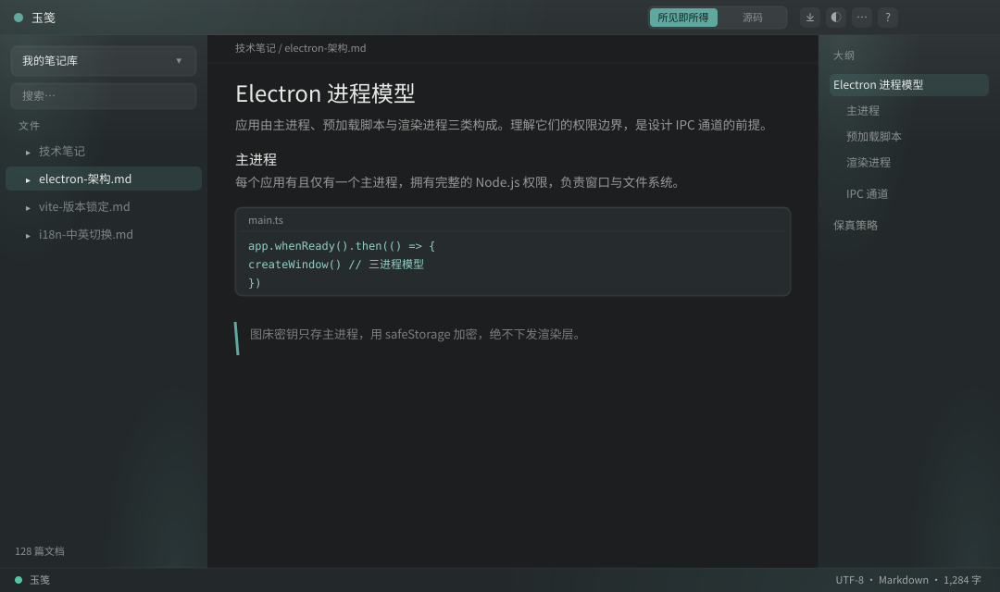
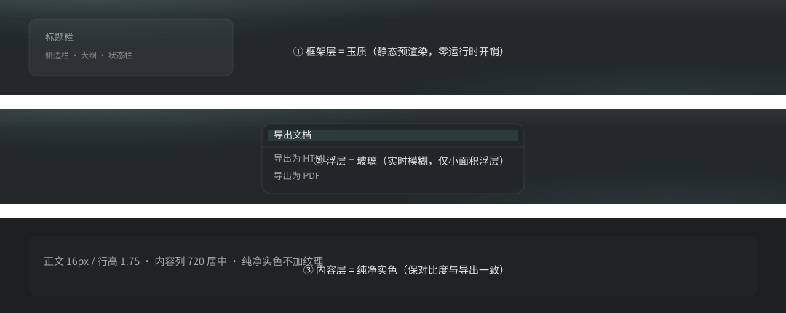
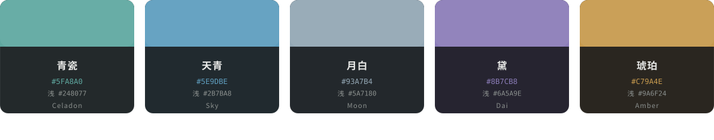
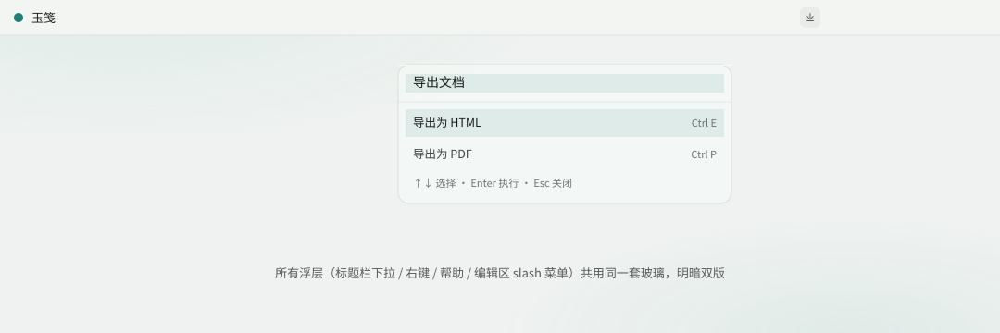
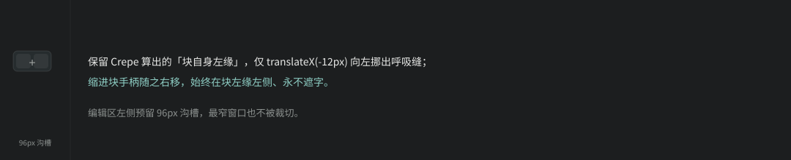
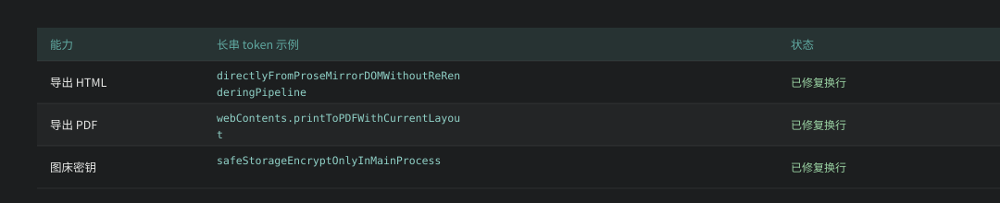

# YuJian Markdown Editor (玉笺)

> A cross-platform, what-you-see-is-what-you-get desktop Markdown editor with a one-click source-mode toggle.
> Built for **technical writing** by default: code highlighting, Mermaid diagrams, math, tables, and multi-format export.

[](https://www.electronjs.org/)
[](https://vuejs.org/)
[](https://milkdown.dev/)
[](./LICENSE)
[](#installers)
[](./README.md)

> 🇨🇳 **中文文档**: [README.md](./README.md) ｜ 📐 Style report (v1): [docs/preview/style-report-v1.html](./docs/preview/style-report-v1.html)

**YuJian** (玉笺, literally "a letter on jade") is a local-first Markdown writing tool: a folder *is* your vault, documents are plain `.md` files, and your data is always readable, Git-friendly, and portable. The editing core is built on [Milkdown Crepe](https://milkdown.dev/); Markdown is a first-class citizen, and an unedited document is written back byte-for-byte.

Visually, YuJian speaks the language of **jade** — a jade-textured framework, glassy floating layers, and a clean solid-color content surface — and ships with five traditional Chinese kiln-inspired skins (Celadon / Sky / Moon / Dai / Amber) plus dark / light / system modes.



***

## ✨ Features

### Editing experience

* **Dual-mode editing** — WYSIWYG by default, one-click to source mode (`Ctrl + /`); both modes share the same Markdown text with no content loss on switch.
* **Markdown round-trip fidelity** — an unedited document is saved verbatim, so formatters never pollute your Git diff.
* **Technical-writing suite** — syntax highlighting (`@codemirror/language-data`, all languages), **adaptive code-block height** (compact for short snippets, `70vh` cap for long, with its own jade scrollbar), Mermaid diagrams, KaTeX math, tables, task lists.
* **Unified jade content theme** — every native element in the editor (code panels, tables, blockquotes, inline code, rules, list markers, task checkboxes, images, floating menus) uses jade design tokens and reacts live to the five skins and light/dark mode.
* **Unified glass material (all overlays)** — title-bar dropdowns, context menus, help / preferences / appearance panels, and *every* in-editor Crepe overlay (slash menu, selection bubble, link preview / editor, block "+" menu) **share one glass recipe**, switching with light/dark (dark = ink-jade translucency, light = mutton-fat-jade translucency). Zero inconsistency app-wide.
* **Long-token table wrapping** — tables use `table-layout: fixed`; unbreakable bold/emphasized tokens now wrap inside the cell instead of overflowing or overlapping neighbors.
* **Consistent left-rail block handles** — add/drag handles now anchor to the **block's own left edge** (Notion-style; indented blocks shift right, never flip to the right side) and sit in a fixed gutter 12px left, redone as a jade-glass pill that never covers text.
* **Polished empty states** — centered icon badge + hint when no vault/doc is open.
* **Document outline** — right panel extracts headings live; click to jump; current section auto-highlights on scroll (100ms throttle).
* **Customizable panels** — sidebar and outline toggle independently (title-bar icons or `Ctrl+\` / `Ctrl+Shift+\`); state persisted; auto-collapse on narrow windows.
* **Jade scrollbars** — thin, rounded, translucent scrollbars everywhere, following skin & mode.
* **Reading progress bar** — the editor's native scrollbar is hidden; a right-side jade progress bar (celadon gradient + soft glow, round thumb on hover/drag, click-to-jump) indicates position.

### Title bar & help

* **Icon toolbar (redesigned)** — three semantic groups: File / Vault (new · switch vault · open) ｜ View / Layout (WYSIWYG⇄source segmented · sidebar · outline) ｜ Share / Tools (export ⌄ · appearance · more ⌄ · help ?). Low-frequency actions live in dropdowns. Window controls are self-drawn on Windows only; macOS yields to native traffic lights.
* **Help panel** — title-bar "?" or `F1` opens a glass panel with **Shortcuts** and **Guide** tabs: shortcuts grouped by File / View / General as `kbd` capsules; a 6-step illustrated quick start.

### Vault

* **Folder = vault** — open any folder as the workspace; the left tree browses all `.md` inside.
* **Auto-save + crash recovery** — edit state persisted to `userData/session.json`; last vault/doc restored on restart.
* **External change sync** — a single chokidar watcher reflects edits/deletes from other programs in real time.
* **Switch working folder** — the title-bar folder icon switches to another directory **without restarting**; current doc auto-saved first.
* **Full-text search** — MiniSearch inverted index; click a result to jump to the hit line (auto-switches to source for precise jumps).

### Version snapshots & writing aids

* **Version snapshots** — `.yujian-history/` in the vault (separate from the `.mdeditor/` cache, suggested to your `.gitignore`); the title-bar "history" icon opens a glass panel where you can manually save a snapshot with a **note** (e.g. "before publish"); the list shows time + note + char delta, and selecting one renders a **line-level diff** (`diff@7`, add / remove / context) — rollback loads the snapshot into the editor and marks it dirty, **without overwriting the original on disk** (Markdown round-trip fidelity).
* **Writing stats** — the status bar shows "hanzi · words · reading minutes"; click it for a glass popover with hanzi / words / chars (with/without spaces) / reading time breakdown + current **selection stats** + an SVG progress ring for your **writing goal** (persisted with the session).
* **Focus mode** — the title-bar "moon" icon enters a merged typewriter + zen experience: the current line is vertically centered (upper 1/3, smooth scroll, paused on blur) while the active block is **highlighted** and the rest **dimmed** (non-destructive ProseMirror decoration, never touches the document); state restores with the session.

### Images & image host

* **Paste to disk** — pasted images land in a sibling `.assets` folder with relative paths; local is the single source of truth.
* **Image host publish** — SM.MS and custom (PicGo-compatible) hosts; keys encrypted in the main process via `safeStorage`, never sent to the renderer. Batch-replace local images with remote URLs for publishing (e.g., WeChat).

### Export

* **Export HTML** — takes the ProseMirror DOM directly (WYSIWYG delivery), inlining rendered math and Mermaid.
* **Export PDF** — via `webContents.printToPDF`, matching the in-editor look.

### Appearance & personalization

* **Five skins** (traditional Chinese kiln palette) — Celadon (default), Sky, Moon, Dai, Amber, each with dark / light.
* **Three modes** — dark / light / follow system (`prefers-color-scheme`).
* **Material system** — jade framework, glass overlays (`backdrop-filter`), solid content surface for contrast & export fidelity.
* **Persistence** — skin/mode saved to `localStorage`; switching skin does **not** rebuild the editor instance.

### Preferences

* **Startup behavior** — restore last session (default) or always start fresh; persisted in `session.json`.

### Internationalization

* **Chinese / English** — one-click switch in the status bar; Crepe menu labels rebuild with the language (Vue `:key` remount), UI text updates reactively.

***

## 🎨 Design philosophy · three material layers

Jade is not about being green — it is about being **warm and lustrous**: light scatters inside, color is uneven, edges glow, and there is a cloudy interior. YuJian splits the UI into three layers, each with one material:



1. **Framework layer (title bar / sidebar / outline / status bar) = jade, statically pre-rendered.** Gradient + fine noise (`feTurbulence`, opacity .045) rendered once — **zero runtime cost** — mimicking jade's scattered translucency; the brand core.
2. **Floating layer (all menus / command palette / dialogs) = glass.** Real-time `backdrop-filter: blur(28px) saturate(160~180%)` only on small overlays — glass only makes sense when there is something behind it to blur, and only then is the cost worth it.
3. **Content layer (editor) = solid color, never textured.** Three reasons: reading fatigue, contrast risk below WCAG AA, and **breaking the "take the DOM directly" WYSIWYG export consistency**.

> "Jade" over pure glass because window-level material is inconsistent across platforms (macOS `vibrancy`, Win11 `mica` can show the desktop; Win10 and below fall back to solid) — jade still holds up when degraded.

***

## 🎨 Five skins · traditional Chinese kiln palette

The appearance panel shows real jade-material thumbnails; the selection ring uses an outer stroke so it never covers the material. Each skin has **dark / light** plus "follow system". Switching skin **does not rebuild the editor instance** (Crepe only reads CSS variables); the root node carries `data-skin` / `data-mode`, persisted to `localStorage`. Default: Celadon + Dark.



| Skin    | 中文 | Dark accent | Light accent | Character                                              |
| ------- | -- | ----------- | ------------ | ------------------------------------------------------ |
| Celadon | 青瓷 | `#5FA8A0`   | `#248077`    | Ru-ware blue-green, the most "jade"-like (default)     |
| Sky     | 天青 | `#5E9DBE`   | `#2B7BA8`    | "sky after rain", cool blue                            |
| Moon    | 月白 | `#93A7B4`   | `#5A7180`    | moon-white glaze, very pale blue-white, low saturation |
| Dai     | 黛  | `#8B7CB8`   | `#6A5A9E`    | ink-violet, the only cool-purple skin                  |
| Amber   | 琥珀 | `#C79A4E`   | `#9A6F24`    | old amber, the only warm skin                          |

**Structure/material layers are decoupled from the hue layer** — switching skin only changes `--hue-*` hue variables; typography, grid, radius, and motion tokens never change.

***

## 🪟 Unified glass · one material for every overlay

v1 collapses the earlier fragmentation (export dropdown, more dropdown, and about panel each had their own glass) into a **single source of truth with dark/light variants**, covering title-bar dropdowns (export / more), context menus, help / preferences / appearance panels, and the in-editor Crepe slash menu, selection bubble, and link preview / editor. Click outside or `Esc` to close.



***

## 🔧 Detail polish

### ① Title bar redesign — grouped icon toolbar

No more "shove a text button wherever". Three semantic icon groups: File / Vault ｜ View / Layout ｜ Share / Tools. Dividers mark group boundaries; 28×28 icon targets meet touch; active state uses accent + jade highlight echoing the segmented control's "on". The whole bar is draggable (`-webkit-app-region: drag`); self-drawn window buttons render on Windows only (macOS yields 78px to native lights).

### ② F1 help panel — shortcuts + guide

`F1` opens it directly (a prior key-guard bug that swallowed F1 is fixed). Glass panel with Shortcuts / Guide tabs; ↑↓ to choose, Enter to run, Esc to close; keys fixed, descriptions localized, bilingual.

### ③ Block handles — consistent left rail, never covers text

Keeps Crepe floating-ui's **block-left-edge**, nudged only `translateX(-12px)` for breathing room; indented blocks shift right, always left of the block edge, never covering text. A `96px` gutter (≈64px handle + 12px shift + 20px margin) prevents clipping even at the narrowest window.



### ④ Long-token table wrapping — no more overlap

Tables use `table-layout: fixed`; previously bold/emphasized unbreakable tokens burst the cell and overlapped neighbors. Now `overflow-wrap: anywhere; word-break: break-word; white-space: normal` wraps any token inside the cell. Accent-filled header, zebra rows, hairline grid, rounded corners.



### ⑤ Code blocks & reading progress — jade details

Code blocks get **adaptive height** (no longer fill the parent) with an inset highlight like "a groove on jade"; global scrollbars are thin, rounded, translucent, brightening only one notch on hover; the editor's native scrollbar is hidden in favor of the **right-side jade reading progress bar**.

***

## 🧱 Tech stack

| Layer       | Choice                         | Notes                                          |
| ----------- | ------------------------------ | ---------------------------------------------- |
| Runtime     | Electron 44                    | official prebuilt binary, no C++ toolchain     |
| Build       | electron-vite 5 + vite \~7.3.6 | vite must stay < 8 (electron-vite peer limit)  |
| Frontend    | Vue 3.5 + TypeScript \~5.9.3   | `<script setup>` + composition API             |
| Editor core | @milkdown/crepe 7.22.1         | ProseMirror + remark, best Markdown round-trip |
| Source mode | CodeMirror 6                   | shares the same Markdown text with WYSIWYG     |
| Diagrams    | Mermaid 11 / KaTeX 0.18        | diagrams & math                                |
| Search      | MiniSearch 7                   | pure-JS inverted index, no native compile      |
| Watch       | chokidar 4                     | vault file watching (single watcher)           |
| State       | pinia 4                        | cross-component state (verified with Vue 3.5)  |

> Dependency choices are driven by local constraints: no MSVC / no WebView2, so Tauri is out; we also avoid anything needing node-gyp (better-sqlite3 / sharp / resvg), preferring pure JS or WASM.

***

## 🏗️ Architecture

Three processes, clear security boundary:

```
┌─────────────┐   contextBridge (allowlist)   ┌────────────────┐
│  main proc   │ ──────── safe IPC ────────▶ │   preload      │
│ (Node perms) │                              │  (window.api)  │
│ files/host/… │ ◀──────── events ───────────│               │
└─────────────┘                              └───────┬────────┘
                                                  │ bridged API
                                                  ▼
                                         ┌────────────────┐
                                         │  renderer proc  │
                                         │  Vue 3 sandbox  │
                                         │  EditorHost …  │
                                         └────────────────┘
```

* `contextIsolation: true`, `nodeIntegration: false`, `sandbox: true` — the renderer gets no Node power.
* Image-host keys live only in the main process, encrypted with `safeStorage`, never in the renderer.
* Session state (`vaultPath` / `activePath` / `mode` / `sidebarWidth` / `startupMode`) is the `SessionState` type in `electron/shared/ipc-channels.ts`; the main `session.ts` writes atomically (temp file + rename).

Full module layout, data flow, fidelity strategy, and risk handling: **[`docs/ARCHITECTURE.md`](./docs/ARCHITECTURE.md)**.

***

## 🚀 Quick start

```bash
# install deps (.npmrc pins npmmirror mirrors)
npm install

# dev mode (HMR). scripts/dev.mjs strips IDE-injected ELECTRON_RUN_AS_NODE
npm run dev

# type check
npm run typecheck

# build to out/
npm run build

# package the current platform
npm run dist        # Windows: NSIS
npm run dist:mac    # macOS: dmg (build on macOS)
npm run dist:linux  # Linux: AppImage (build on Linux)
```

If the Electron binary fails to download, fetch it manually:

```bash
ELECTRON_MIRROR="https://npmmirror.com/mirrors/electron/" node node_modules/electron/install.js
```

***

## ⚠️ Known environment gotchas

**1. `ELECTRON_RUN_AS_NODE` prevents the window from opening**

Some IDEs (WorkBuddy, VS Code) are themselves Electron apps and inject `ELECTRON_RUN_AS_NODE=1` into child shells, degrading `electron.exe` to plain Node:

* `process.type` becomes `undefined` (should be `browser`);
* `require('electron')` returns a **binary path string**, not the API object;
* the app throws no error but never creates a window.

`scripts/dev.mjs` deletes `process.env.ELECTRON_RUN_AS_NODE` before launch, so `npm run dev` works. To run manually:

```bash
env -u ELECTRON_RUN_AS_NODE ./node_modules/electron/dist/electron.exe .
```

**2. `electron --version` prints the bundled Node version**

Electron 44 bundles Node 24.18.1 + Chrome 152; `--version` reports Node. The real Electron version is in `node_modules/electron/dist/version`.

**3. Electron binary download**

`.npmrc` pins npmmirror mirrors. Note `npm config set electron_mirror` is rejected on npm 10 (unregistered key) — write `.npmrc` directly.

**4. GPU-less sandbox exits immediately**

In a GPU-less sandbox the GPU process crashes repeatedly and triggers "GPU process isn't usable. Goodbye". Set `MD_EDITOR_COMPAT_MODE=1 npm run dev` for compat mode (adds `--no-sandbox`).

***

## 📐 Design docs

* **[`docs/preview/style-report-v1.html`](./docs/preview/style-report-v1.html)** — v1 style report (strictly from the real implementation; open in a browser; the figures in this README share the same source).
* **[`docs/UI-DESIGN.md`](./docs/UI-DESIGN.md)** — design tokens, component specs, material system (jade / glass), skin architecture.
* **[`docs/ARCHITECTURE.md`](./docs/ARCHITECTURE.md)** — architecture, module layout, fidelity strategy, roadmap, risks.

***

## 🗺️ Roadmap

| Phase            | Goal                                                       | Status                                                                                  |
| ---------------- | ---------------------------------------------------------- | --------------------------------------------------------------------------------------- |
| 0. Foundation    | scaffold + window + IPC                                    | ✅ done                                                                                  |
| 1. Editor core   | Crepe + dual mode + open/save                              | ✅ done                                                                                  |
| 2. Vault         | file tree + auto-save + crash recovery                     | ✅ done                                                                                  |
| 3. Writing suite | Mermaid + math + tables + code                             | ✅ done                                                                                  |
| 4. Images        | paste-to-disk + image host                                 | ✅ done                                                                                  |
| 5. Search        | MiniSearch index + search panel                            | ✅ done                                                                                  |
| 6. Export        | HTML / PDF / single md                                     | ✅ done                                                                                  |
| 7. Polish        | themes/skins, shortcut hints, settings, title-bar redesign | ✅ done (skins + preferences/appearance + icon toolbar + help/shortcuts + unified glass) |
| 8. Distribution  | electron-builder + **3-platform CI**                       | ✅ done (v1.0.0; GitHub Actions builds Win/macOS/Linux installers)                       |
| 9. Phase 2       | multi-doc tabs + find/replace + version snapshots + writing stats + Focus (typewriter/zen) mode + export enh. + writing aids + link check | 🔧 batch 1 done (multi-doc tabs · in-file find/replace · selection count); batch 2 done (version snapshots · writing stats · Focus mode); batch 3 pending (see [`docs/PHASE2-PLAN.md`](./docs/PHASE2-PLAN.md)) |

**Beyond the roadmap**: bilingual i18n, switch working folder, startup preferences, five skins + dark/light/system, app icon (YuJian), independent panel toggle, jade scrollbars, adaptive code height, right-side reading progress, title-bar icon toolbar redesign, help & shortcut panel (F1), consistent left-rail block handles, unified glass (all overlays follow mode), long-token table wrapping, size trimming (asar + max compression + zh/en locales only).

***

## 📦 Installers

### Local build (v1.0.0)

* **Build**: `npm run dist` (then `electron-vite build` + `electron-builder --win`); publish to GitHub Release with `npm run release` (tag `v*` first).
* **Windows**: `release/yujian-1.0.0-setup.exe` (NSIS, \~140MB) — customizable dir, desktop + Start-menu shortcut "玉笺" by default.
* **Cross-platform**: macOS `dmg`, Linux `AppImage` targets configured; **must build on the target OS** (see below).
* **Size strategy**: `asar` + max compression + zh/en locales only; removed unused `@codemirror/theme-one-dark`.
* **Size note**: the package is dominated by the Electron runtime and the Mermaid engine; Mermaid is lazy-loaded (only on render) and works offline. Switch to CDN loading for further trimming.

### Automated 3-platform release (GitHub Actions)

Pushing a `v*` tag triggers [`.github/workflows/release.yml`](./.github/workflows/release.yml): it creates a **draft release** on Ubuntu, then builds and uploads installers to that same release in parallel on **windows-latest / macos-latest / ubuntu-latest**.

| Platform | Artifact                     | Target            |
| -------- | ---------------------------- | ----------------- |
| Windows  | `yujian-{version}-setup.exe` | NSIS installer    |
| macOS    | `玉笺-{version}.dmg`           | DMG disk image    |
| Linux    | `yujian-{version}.AppImage`  | AppImage portable |

> **Code signing (optional)**: unsigned builds warn (Windows SmartScreen; macOS needs right-click "Open" + allow). Configure `WIN_CSC_LINK` / `WIN_CSC_KEY_PASSWORD` (Windows Authenticode) and `CSC_LINK` / `CSC_KEY_PASSWORD` / `APPLE_ID` / `APPLE_APP_SPECIFIC_PASSWORD` / `APPLE_TEAM_ID` (macOS sign + notarize) in **Settings → Secrets** and CI signs automatically. CI uses official mirrors by default (unaffected by the local `.npmrc` npmmirror).

Release flow:

```bash
git tag v1.0.0
git push origin v1.0.0
# → GitHub Actions builds the three-platform installers into a draft release
# → review on the GitHub Releases page, then click Publish
```

***

## 📄 License

[MIT](./LICENSE). The repository is currently public ([liu-li-huan-ying/yujian](https://github.com/liu-li-huan-ying/yujian)).
