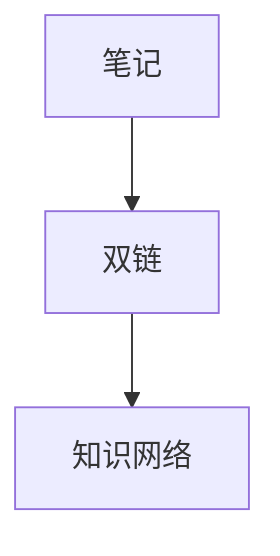

# 玉笺 Markdown 编辑器 · 使用说明

> 玉笺是一款**跨平台、所见即所得（WYSIWYG）且可一键切换源码**的 Markdown 编辑器，在 Phase 3 进化为个人知识库（PKM）工具：**双向链接、标签、内容地图（MOC）、版本快照、整库备份**一应俱全，同时坚守「Markdown 往返保真」——保存后的 `.md` 文件始终是干净的标准 Markdown，可被任何编辑器打开。

这份说明会随软件安装一并自带，帮助你快速上手。你也可以用它当作练习：文中的 `[[双链]]`、`#标签`、`moc: true` 都是真实语法，打开本文件后试试「更多 → 内容地图」就能看到聚合效果。

---

## 目录

1. [欢迎与界面概览](#一欢迎与界面概览)
2. [快速上手](#二快速上手)
3. [编辑基础](#三编辑基础)
4. [双向链接与知识网络](#四双向链接与知识网络)
5. [标签](#五标签)
6. [内容地图 MOC](#六内容地图-moc)
7. [搜索](#七搜索)
8. [写作辅助](#八写作辅助)
9. [数据安全](#九数据安全)
10. [导出](#十导出)
11. [外观与偏好](#十一外观与偏好)
12. [文件管理（侧栏）](#十二文件管理侧栏)
13. [快捷键与帮助](#十三快捷键与帮助)
14. [小贴士与常见问题](#十四小贴士与常见问题)

---

## 一、欢迎与界面概览

玉笺的窗口分为三块：

| 区域 | 位置 | 作用 |
| --- | --- | --- |
| **标题栏** | 顶部 | 新建 / 切换库 / 打开、侧栏与大纲开关、历史与专注、导出、更多菜单 |
| **侧栏** | 左侧 | 文件树、搜索框、右键新建/重命名/移动/删除 |
| **编辑区** | 中部 | 所见即所得编辑，可切源码；右侧可展开「大纲」 |

标题栏最右侧的 **「更多 ⌄」** 是功能中枢，几乎所有高级面板都从这里进入：图床、偏好、链接检查、反链、标签、内容地图、插入双链、写作辅助、完整性、备份、帮助、关于。

> 💡 **提示**：把鼠标悬停在标题栏的图标按钮上，会显示中文名称与快捷键。

---

## 二、快速上手

### 打开或新建笔记库
- **切换库**：标题栏「切换库」图标 → 选择一个文件夹作为你的「笔记库（Vault）」。库就是普通的文件夹，里面全是 `.md` 文件，玉笺不会把它锁死成私有格式。
- 首次打开一个**空的笔记库**时，玉笺会自动放入这份《使用说明》作为欢迎文档。

### 新建第一篇笔记
- 标题栏「新建」图标，或侧栏空白处右键 → **新建文档**。
- 直接在编辑区打字即可。顶部标题栏显示的当前文件名，可**双击**重命名。

### 所见即所得 ↔ 源码
- 快捷键 **`Ctrl + /`** 在「所见即所得」与「源码（Markdown 文本）」之间切换。
- 所见即所得模式下，你看到的是渲染效果；源码模式给你逐字控制的自由。两者**共用同一份 `.md`**，切换不丢内容。

---

## 三、编辑基础

编辑器顶部有一个**悬浮工具条**（选中文字或聚焦段落时出现），提供加粗、斜体、删除线、标题、列表、引用、代码、链接、图片、表格、公式等常用格式。

### 标题与正文
```markdown
# 一级标题
## 二级标题
### 三级标题

普通段落直接换行即可。空一行开始新段落。
```

### 列表
- **无序列表**：`- ` 或 `* ` 开头。
- **有序列表**：`1. ` 开头，序号自动延续。
- **任务列表**：`- [ ] 待办` / `- [x] 已完成`，勾选框可在编辑区直接点击。

### 表格
用 `|` 分隔列，第二行写 `---` 定义表头。编辑区内可**拖动行列、设置对齐**。

```markdown
| 功能 | 说明 |
| --- | --- |
| 双链 | 笔记间互相链接 |
| 标签 | 横向归类 |
```

### 代码块
围栏代码块支持多语言高亮，并可在编辑区**直接预览**图表类代码：

````markdown
```ts
const greet = (name: string) => `Hello, ${name}`
```


````

> 💡 Mermaid 流程图、时序图等会在编辑区直接渲染成图，无需切到预览。

### 数学公式（MathJax）
- **行内公式**：用 `$...$` 包裹，例如 `$E = mc^2$`。
- **块级公式**：用 `$$ ... $$` 包裹，支持编号与交叉引用 `\label{}` / `\eqref{}`。

```markdown
质能方程：$$ E = mc^2 $$

参见式 \eqref{eq:emc}：
$$
\begin{equation}\label{eq:emc} E = mc^2 \end{equation}
$$
```

### 脚注、表情、行内标记
- 脚注：`[^1]` 定义、`[^1]: 说明` 写内容，编辑区可点击双向跳转。
- 表情符号：输入 `:smile:` 自动转为 😄。
- 行内标记：`==高亮==`、`^上标^`、`~下标~`。

### 图片
- 本地图片：直接拖入编辑区，或工具条「图片」插入，文件会存入笔记旁的 `.assets` 文件夹。
- 图床：在「更多 → 图床」配置后，可一键上传并替换为网络链接（密钥仅存本机）。

---

## 四、双向链接与知识网络

这是玉笺作为知识库的核心能力。

### `[[双链]]`
- 在正文输入 `[[` 会弹出**自动补全浮层**，列出库内笔记，选中即生成双链芯片。
- 语法： `[[笔记名]]` 或带别名 `[[笔记名|显示的别名]]`。
- **点击芯片**即可跳转；若目标不存在，会提示**一键创建**该笔记。

### 反链面板（谁链接到我）
- 打开「更多 → 反链」，面板按来源笔记列出「谁链接了当前这篇」，并显示引用行与上下文片段，点击直接跳转。
- 切文档、重命名、删除后自动刷新。

### 未链接提及
- 反链面板里有一组「未链接提及」：正文里出现当前笔记标题、却还没变成 `[[链接]]` 的文字，可**一键包裹成双链**。

### 断链检查
- 「更多 → 链接检查」扫描库内所有 `[[链接]]`，标出**指向不存在笔记的断链**，并支持**一键创建**目标笔记。

---

## 五、标签

标签用于横向归类，与双链（纵向连接）互补。

- **frontmatter 标签**：在笔记顶部写
  ```markdown
  ---
  tags: [阅读, 心理学]
  ---
  ```
- **正文内联标签**：直接写 `#阅读` `#心理学`，如同普通文字一样跟随上下文。

两种写法会被**自动合并**到索引。打开「更多 → 标签」面板，可以：
- 浏览**标签树**（按 `/` 嵌套，如 `#主题/哲学`）；
- 点击标签**钻取**其下全部笔记（父标签包含子标签）。

---

## 六、内容地图 MOC

当你想围绕一个主题把多篇笔记聚合成「入口页」时，用内容地图（Map of Content）。

### 设为内容地图
1. 打开一篇笔记 → 「更多 → 写作辅助」。
2. 在「属性」页勾选 **设为内容地图**，应用后该笔记的 frontmatter 会写入 `moc: true`：
   ```markdown
   ---
   title: 我的阅读主题页
   moc: true
   ---
   ```

### 查看聚合
打开「更多 → 内容地图」，若当前是 MOC，会按三组自动聚合下级笔记：
- **自身标签**：本篇每个标签旗下的笔记；
- **本图链出**：本篇用 `[[双链]]` 指向的笔记；
- **挂到本图**：反向链接到本篇的笔记。

每组可折叠，点击笔记即打开。若当前不是 MOC，面板会列出全库已有的内容地图供你跳转，并提示如何把本篇变成 MOC。

---

## 七、搜索

- 快捷键 **`Ctrl + F`** 聚焦侧栏搜索框。
- 支持两种范围：**全库**（跨所有笔记）与**本文档**（仅当前笔记）。
- 结果点击直接跳转并定位到命中行；`F3` / `Shift + F3` 在命中之间循环。

---

## 八、写作辅助

打开「更多 → 写作辅助」，分两个标签页：

- **属性**：填写标题 / 作者 / 描述 / 标签 / 日期，以及「设为内容地图」开关。这些写入 frontmatter，且**绝不改动正文**。
- **片段**：一键在光标处插入常用模板（文档骨架、代码块、表格、标注、任务清单、脚注、Mermaid、数学公式）。

---

## 九、数据安全

> 玉笺把你的笔记当作最高价值。所有保护机制都遵循「只重建索引、绝不静默改写你的原文」。

### 完整性自检
「更多 → 完整性」会检查：索引与磁盘是否一致、索引是否缺失/损坏、是否有孤儿快照。可**一键修复**（重建索引、清理回收站中的孤儿快照），全程不碰你的文档正文。

### 整库备份与恢复
「更多 → 备份」把整个笔记库（含 `.md`、附件、索引、历史快照）打包成 zip；恢复时解包还原。建议重要节点手动备份一次。

### 版本快照与历史
标题栏的 **「历史」图标**（时钟状）打开快照面板：
- 查看本文档的历史版本，**逐段对比差异（diff）**；
- **恢复**某个历史版本，或把某一段变更**摘取（cherry-pick）**回当前文档；
- 删除的快照走系统回收站，可找回。

### 外部修改冲突
当笔记在玉笺外被别的程序改动时，再次回到玉笺会弹出**冲突对话框**，提供三选一：**保留我的 / 采用磁盘版本 / 双方对照**——玉笺**绝不静默覆盖**你的任何一版内容。

---

## 十、导出

标题栏「分享 / 工具」或「更多」中提供多种导出：

| 格式 | 说明 |
| --- | --- |
| **PDF** | 可直接打印 / 分享的排版稿 |
| **LaTeX** | 适合学术投稿，公式保真 |
| **Word (DOCX)** | 交 Office 协作 |
| **EPUB** | 电子书 |
| **RTF / ODT** | 通用富文本 / LibreOffice |
| **编译** | 把整个笔记库合订成一份文档或站点（可选「每篇一页」「目录」「封面」等） |

导出前可设置选项（目录、封面、内联、选区、预览），并先预览再落盘。

---

## 十一、外观与偏好

- **主题 / 外观**：「更多 → 偏好」或「外观」中切换浅色 / 深色等多套主题；编辑器与界面统一换肤。
- **专注模式**：标题栏「月亮」图标进入**凝神模式**（雾与纸的沉浸背景，隐去干扰）；「更多 → 专注设置」可微调。
- **图床**：「更多 → 图床」配置图床账号，用于图片上传（密钥仅存本机 `safeStorage`）。
- **偏好设置**：「更多 → 偏好」集中管理各项开关。

---

## 十二、文件管理（侧栏）

- **新建**：侧栏右键 → 新建文档 / 新建文件夹。
- **重命名**：**双击**文件名，或在右键菜单中重命名（含扩展名，避免丢后缀）。
- **删除**：选中后按 **`Delete`** 键，或右键删除（走系统回收站）。
- **移动 / 拖拽**：拖动文件或文件夹到目标位置；移动文件夹时，其内部所有文档的标签、历史、关联数据会**一并带走**。

> ⚠️ 移动或删除「正在编辑」的文档前，玉笺会先取消其待保存并关闭相关标签，避免自动保存把已删文件「复活」。

---

## 十三、快捷键与帮助

- **帮助面板**：「更多 → 帮助」打开内置浮层，含**快捷键一览**与**使用指南**。
- **关于**：「更多 → 关于」查看版本与版权。

常用快捷键：

| 快捷键 | 功能 |
| --- | --- |
| `Ctrl + /` | 所见即所得 ↔ 源码 |
| `Ctrl + S` | 保存 |
| `Ctrl + O` | 打开文件 |
| `Ctrl + F` | 搜索（侧栏，全库 / 本文档） |
| `Ctrl + \` | 切换侧栏 |
| `Ctrl + Shift + \` | 切换大纲 |
| `F3` / `Shift + F3` | 下一个 / 上一个搜索命中 |
| `Delete` | 删除选中的侧栏文件 / 文件夹 |

---

## 十四、小贴士与常见问题

**Q：保存后我的 `.md` 会被加点私货吗？**
不会。玉笺严守「Markdown 往返保真」：未编辑的文档保存后一字不改；自定义语法（双链、标签）都以真实节点存储并原样写回 `[[...]]` / `#标签`，可被任何标准 Markdown 工具读取。

**Q：笔记库能有多大？**
统一索引层只存轻量元数据（路径、标题、标题层级、出链、标签），不缓存正文、不建全文索引，设计目标是在数千篇笔记下也不卡顿。

**Q：双链目标怎么解析？**
按「文件名（去扩展名）」或相对库根路径匹配，忽略 `.md` 后缀与 `./` 前缀；库内重名时按路径更精确的优先。

**Q：本说明文件能删吗？**
可以。它是普通笔记，删掉不会被重新塞回（我们尊重你的每一次删除）。它只在**全新空库**首次打开时自动出现。

---

> 愿你用玉笺，把零散的笔记连成网络，把一时的想法沉淀为可循的知识。
